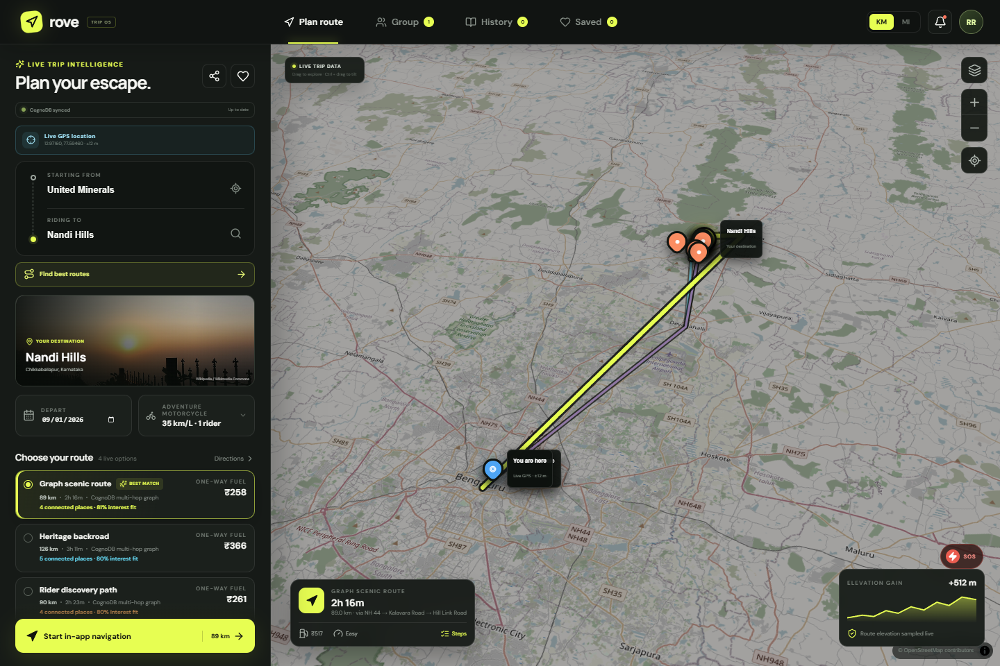
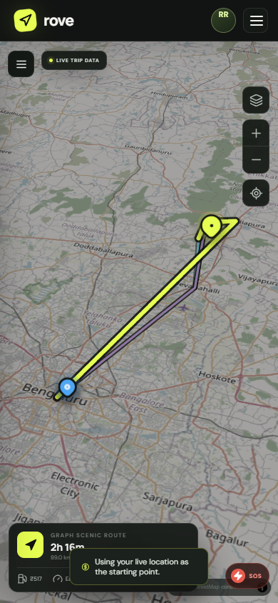
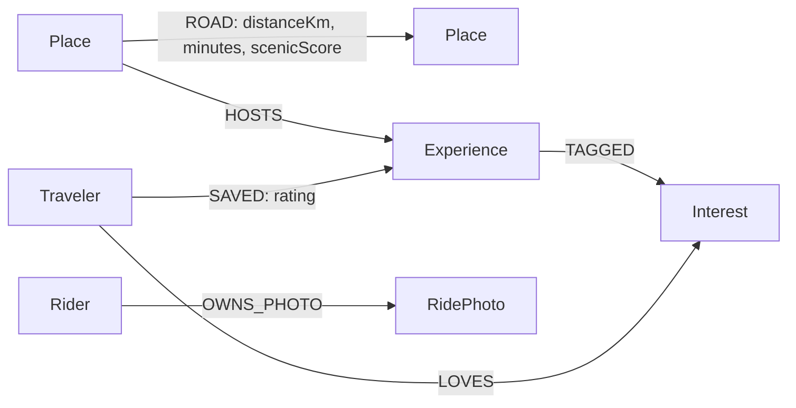

# Rove — Graph Trip OS

Rove is a full motorcycle trip planner backed by CognoDB. It combines live GPS navigation, India-first place search, road routing, weather, elevation, budgets, groups, expenses, saved rides, journals, and real destination photography with graph-native route discovery and explainable recommendations.

**[Open the hosted application](https://trip-planner-t4ln.onrender.com)** · [Watch the narrated walkthrough](docs/rove-cognodb-walkthrough.webm)



| Desktop planner | Responsive live map |
| --- | --- |
|  |  |

## What CognoDB does

CognoDB replaces Firebase and is the application's persistent data layer:

- Rider accounts with server-side password hashing
- Saved trips, group members, shared expenses, settings, and ride history
- Journal photo data and metadata
- Indian places, roads, experiences, interests, and synthetic recommendation profiles
- Variable-length multi-hop route discovery
- Interest-based and traveler-informed experience recommendations
- Related-experience “constellation” traversals

All database access goes through the official Neo4j JavaScript driver using parameterized openCypher over the CognoDB Bolt endpoint. Credentials remain on the server and are never sent to the browser.

## Why a graph database?

Rove's important questions are about relationships:

- Which cycle-free road paths connect Bengaluru and Nandi Hills in at most six hops?
- Which path combines scenic roads with viewpoints, heritage, food, and photography?
- Which experiences are hosted by places along that path?
- What else might this rider like because it shares interests and saves from similar travelers?

A relational implementation would need recursive CTEs for routes followed by an expanding chain of joins across places, roads, experiences, tags, travelers, and saves. CognoDB expresses the domain directly as traversals. The path that produces a recommendation also explains it.

## Graph model



`Rider` nodes also hold serialized application state for saved trips, group members, expenses, history, and bike settings. Public travel nodes are replaced when `npm run seed` runs; rider accounts and private rider data are deliberately preserved.

## Complete feature set

### Live route planning

- Browser GPS permission, accuracy checks, and continuous `watchPosition()` tracking
- Current-position map marker and follow-camera mode
- Automatic off-route detection and rerouting
- Turn-by-turn instructions, voice prompts, wake lock, and route progress
- Live OpenStreetMap tiles through MapLibre
- Motorcycle-aware Valhalla routing with OSRM fallback
- CognoDB multi-hop route alternatives for supported Indian destinations
- Emergency location copying and India emergency number `112`

### India-first discovery

- Bengaluru and Nandi Hills defaults
- Search for arbitrary Indian origins and destinations
- Seeded graph destinations including Devanahalli, Chikkaballapur, Skandagiri, Lepakshi, Ramanagara, Mysuru, Hassan, and Chikmagalur
- Nearby fuel, hospitals, motorcycle service, stays, food, and attractions
- Real destination and place photography from Wikipedia/Wikimedia or OpenStreetMap-linked images
- Bundled category artwork only when a trustworthy real image cannot be matched

### Trip tools

- Weather-aware departure dates and traffic windows
- Elevation profile
- Fuel, stay, food, and other-cost budget breakdown
- Generated day-by-day itinerary
- Group members and shared-expense balances
- Saved rides and ride history
- Ride rating, journal text, and photo uploads
- Loading, empty, offline, GPS-error, and database-error states

## Architecture

```text
React + Vite + MapLibre
        │
        ├── Live browser/public services
        │   ├── Geolocation API
        │   ├── Valhalla / OSRM routing
        │   ├── Open-Meteo weather + elevation
        │   ├── Photon / ArcGIS geocoding
        │   ├── OpenStreetMap / Overpass places
        │   └── Wikipedia / Wikimedia photography
        │
        └── Express API
              │ official neo4j-driver
              ▼
          CognoDB Cloud
```

Important files:

- `src/App.jsx` — restored complete Rove interface and trip workflows
- `src/MapView.jsx` — MapLibre map, route projection, live GPS markers, and follow mode
- `src/services.js` — live routing, geocoding, weather, elevation, places, and images
- `src/graphService.js` — adapts CognoDB paths and experiences into Rove routes and map places
- `src/auth.js` — browser session plus CognoDB account API
- `src/cloudStore.js` — CognoDB rider-state synchronization
- `src/journalStore.js` — CognoDB ride-photo persistence
- `server/neo4j-repository.js` — all database access
- `server/queries.js` — parameterized application queries
- `server/seed.js` — idempotent Indian travel-graph loader
- `cypher/queries.cypher` — review-friendly graph query examples

## Main queries

### Multi-hop graph route

The route query traverses `[:ROAD*1..8]`, rejects repeated nodes, respects a parameterized hop limit, and uses `reduce()` over relationship properties to calculate distance, duration, and scenic score.

### Route-aware recommendations

```text
(Place)-[:HOSTS]->(Experience)-[:TAGGED]->(Interest)
                                            ^
                                            └-[:LOVES]-(Traveler)-[:SAVED]->(Experience)
```

Results include the matched interests, kindred saves, and community rating so the UI can explain each recommendation.

### Rider application state

Rider reads and writes are isolated from the public seeded travel graph. Every mutation matches a parameterized `Rider.id`; rerunning the public seed does not delete accounts, saved trips, or journals.

## Run locally

Requirements: Node.js 20+ and a CognoDB Cloud instance.

### Create the CognoDB instance

1. Sign up at [console.cognodb.com/signup](https://console.cognodb.com/signup).
2. In the CognoDB console, create the free `c0` instance and choose the nearest region.
3. Copy the generated password immediately; CognoDB displays it only once.
4. Copy the secure Bolt URI, which has the form `bolt+s://<instance-id>.databases.cognodb.cloud`.
5. Keep the instance running while the submission is under review.

Rove connects through the official Neo4j JavaScript driver. No CognoDB-specific SDK is required.

### Install and run

```powershell
npm install
Copy-Item .env.example .env
```

Fill `.env` with the credentials generated by CognoDB:

```dotenv
NEO4J_URI=bolt+s://your-instance.databases.cognodb.cloud
NEO4J_USERNAME=cognodb
NEO4J_PASSWORD=your-generated-password
DEMO_MODE=false
PORT=8787
```

Load the Indian travel graph and run the app:

```powershell
npm run seed
npm run dev
```

Open `http://localhost:5173`, register a rider account, and allow precise location when the browser requests it.

GPS requires HTTPS or `localhost`. On a desktop without a GPS receiver, the browser may return a Wi-Fi-derived position or the app will use Bengaluru and explain how to retry.

## Real images

Named destinations request coordinate-aware images from Wikipedia/Wikimedia. Restaurants and stays first use explicit OpenStreetMap image links, then accept Wikimedia results only when the business name and destination match. Cards expose image source and distance; mismatches retain safe category artwork.

## Checks

```powershell
npm test
npm run lint
npm run build
```

The repository includes tests for multi-hop paths, related-interest recommendations, and separation of rider state from the public graph.

## Deploy

The included `render.yaml` deploys the React build and Express API as one service. Configure these secrets in Render:

- `NEO4J_URI`
- `NEO4J_USERNAME=cognodb`
- `NEO4J_PASSWORD`
- `DEMO_MODE=false`

Run `npm run seed` once against the production CognoDB instance. The deployed HTTPS URL enables browser geolocation on supported devices.

## Submission links

- Repository: [github.com/kademthriven/trip_planner](https://github.com/kademthriven/trip_planner)
- Hosted demo: [trip-planner-t4ln.onrender.com](https://trip-planner-t4ln.onrender.com)
- 60–90 second walkthrough: [watch or download the repository recording](docs/rove-cognodb-walkthrough.webm)

## Assignment checklist

- [x] CognoDB via the official Neo4j driver
- [x] Labeled nodes, typed relationships, properties, and model diagram
- [x] Realistic Indian seed data and loader
- [x] Parameterized Cypher only
- [x] Multiple multi-hop graph traversals
- [x] A graph-native recommendation query that is awkward relationally
- [x] Functional, responsive, non-technical web UI
- [x] Loading, empty, GPS, network, and database error states
- [x] Environment-only database credentials
- [x] UI screenshots, tests, and deployment configuration
- [x] Push to GitHub and add the repository URL
- [x] Deploy and add the hosted application URL
- [x] Record a 60–90 second walkthrough

## Suggested walkthrough

1. Register and allow live GPS.
2. Plan Bengaluru → Nandi Hills and compare the CognoDB graph paths with the live road option.
3. Show live weather, elevation, budget, nearby places, and real destination imagery.
4. Start navigation briefly to demonstrate GPS tracking.
5. Save the ride, add a group expense, and show that state survives a reload through CognoDB.
6. Open `server/queries.js` and explain the route and recommendation traversals.
